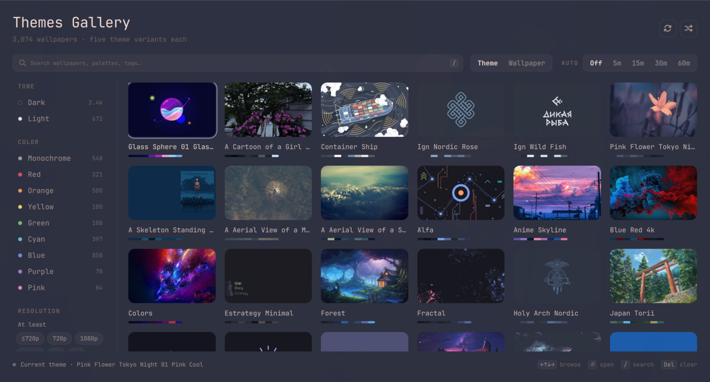

# Themes Gallery — gotar.omarchy-themes

[](https://omarchyplugins.com/plugin.html?id=gotar.omarchy-themes)

> **Install from the marketplace:** [omarchyplugins.com/plugin.html?id=gotar.omarchy-themes](https://omarchyplugins.com/plugin.html?id=gotar.omarchy-themes) — open the page and copy the install command.

Desktop app for **[bjarneo/omarchy-themes](https://bjarneo.github.io/omarchy-themes/)** — 3,000+ wallpapers, each with five theme variants (Palette · Warm · Cool · Material · Aether).

Browse, search and preview like on the website, then apply any variant as a native Omarchy theme in one click. Opens from the app launcher: **Super+Space → Themes Gallery**.



- **Search** (path + title + tags, debounced, same as site)
- **Filters with live counts**: tone (`dark`/`light`), color (9 hues), resolution tier range `≥`/`≤` (720p → 8K+)
- **Responsive grid** of thumbnails (async, cached, recycled while scrolling) with a palette strip; columns follow the window width
- **Detail**: large preview + extracted palette + tags + 5 variants with 16-color ANSI ramps → **Apply** per variant
- **One-click apply**: `bin/apply-theme.py` fetches `colors.toml` and the wallpaper from `wallpapers.hel1.your-objectstorage.com`, writes atomically to `~/.config/omarchy/themes/<slug>/` (`colors.toml` + `backgrounds/`), then `omarchy theme set <slug>`. Re-apply is idempotent. If the theme background is private (403) it falls back to the original wallpaper automatically.
- **Tooltips**: hover any button (shuffle, refresh, reset, Theme/Wallpaper, AUTO intervals, apply) for a hint (`PanelToolTip`).

## Install

### From Omarchy Plugins marketplace (recommended for discovery)

Browse and install from the marketplace page — it shows the verified install command, version and preview:

**[https://omarchyplugins.com/plugin.html?id=gotar.omarchy-themes](https://omarchyplugins.com/plugin.html?id=gotar.omarchy-themes)**

Click **Copy** on the page, then run the copied command (same as below):

```sh
omarchy plugin add https://github.com/gotar/omarchy-themes.git --enable
omarchy restart shell
```

### Direct install (Git URL)

```sh
omarchy plugin add https://github.com/gotar/omarchy-themes.git --enable
omarchy restart shell
```

Alternative — manual clone to `~/.config/omarchy/plugins/gotar.omarchy-themes/`, then `omarchy restart shell`.

The plugin is a kept-loaded panel, so the shell restart is needed once to mount it. On first load it adds `~/.local/share/applications/gotar.omarchy-themes.desktop` (never overwriting your own copy), which puts **Themes Gallery** in the app launcher. It can also be toggled directly:

```sh
omarchy-shell shell toggle gotar.omarchy-themes '{}'
```

Optionally add the 🖼️ bar button too (left-click opens the app, right-click opens Aether). Upgrading from 1.0.x keeps an existing bar button working:

```sh
omarchy bar put gotar.omarchy-themes --after omarchy.weather
```

## Requirements

- **Omarchy** (shell with `omarchy` CLI — `omarchy plugin`, `omarchy theme`, `omarchy-shell` IPC)
- **Python 3.11+** (system `python3`, only stdlib — `urllib`, `json`, `subprocess`, `tempfile`, `tomllib`)
- **A Nerd Font** for the UI glyphs (`JetBrainsMono Nerd Font` on Omarchy)

No other runtime dependencies; the QML side uses only Quickshell + `qs.Commons`/`qs.Ui` shipped with the shell.

## Uninstall

```sh
omarchy plugin remove gotar.omarchy-themes --yes
omarchy-shell shell rescanPlugins
```

This disables the plugin and deletes `~/.config/omarchy/plugins/gotar.omarchy-themes/`. If the plugin was cloned manually instead, just remove the directory and rescan:

```sh
rm -rf ~/.config/omarchy/plugins/gotar.omarchy-themes
omarchy-shell shell rescanPlugins
```

Delete `~/.local/share/applications/gotar.omarchy-themes.desktop` to drop the launcher entry.

The applied themes (`~/.config/omarchy/themes/<slug>/`) are regular Omarchy user themes and stay installed — remove them with `omarchy theme remove <slug>` if you no longer want them. The wallpaper index cache in `~/.cache/gotar.omarchy-themes/` can be deleted (it is re-fetched on next open).

## Update

```sh
omarchy plugin update gotar.omarchy-themes --yes
omarchy-shell shell rescanPlugins
```

For a manual clone:

```sh
cd ~/.config/omarchy/plugins/gotar.omarchy-themes && git pull
omarchy-shell shell rescanPlugins
```

## Use

| Mouse / Key | Action |
|---|---|
| **Super+Space → Themes Gallery** or **left click 🖼️** | Open / close gallery |
| **Right click 🖼️** | Open **Aether** (`aether`) |
| Click card / `Enter` | Open detail |
| `← →` / `↑ ↓` | Browse wallpapers / cycle variant |
| `Enter` in detail | Apply selected variant |
| `Esc` | Back / close |
| `/` | Focus search |
| `Del` | Reset all filters |
| `r` | Re-fetch index (bypass 24 h cache) |

Hover + click everywhere: facets, cards, variant rows, breadcrumbs, search — with tooltips on the controls.

### Random & Auto

- **🔀 Shuffle** (header, next to refresh) — picks a random wallpaper from the *currently filtered* set and applies it (variant + wallpaper in Theme mode, only wallpaper in Wallpaper mode).
- **Mode** — the `Theme ↔ Wallpaper` switch next to the search field. In `Wallpaper` mode `Apply` (and random) only sets the image via `bin/set-wallpaper.py` + `omarchy-theme-bg-set` without touching `colors.toml`/theme — ideal if you love your current theme colors and just want the image.
- **Auto** — the `Off · 5m · 15m · 30m · 60m` switch. When on, a `Timer` fires every interval and calls the same random logic, even while the gallery is closed (the panel is `keepLoaded`). Great for a live wallpaper rotation that respects your tone/color/resolution filters. Set `AUTO 15m` + `dark + green + ≥5K` and you get a fresh dark-green 5K wallpaper every quarter hour.

## How it works

- **Index**: first open runs `bin/fetch-manifest.py` → downloads ~35 MB `https://bjarneo.github.io/omarchy-themes/wallpapers.js` (`window.WALLPAPERS` + `WALLPAPERS_BASE_URL`), slims to ~7 MB JSON (`p/t/tone/color/tags/w/h/thumb/med/pal/th{5×{n,ct,bg,c[16]}}`) and caches to `~/.cache/gotar.omarchy-themes/manifest.json` (24 h TTL). Subsequent opens read cache instantly; if an automatic non-forced refresh fails while offline, the last valid (expired) index is used instead of a dead gallery. Explicit `R`/Retry remains strict and reports a failed forced refresh.
- **Thumbnails / previews**: async `Image`s from the same bucket (`thumb_path`, `medium_path`, `p`). Grid thumbnails are cached and decoded at display size; the grid prebuilds rows and recycles delegates, and mouse-wheel scrolling is eased.
- **Apply**: `bin/apply-theme.py <slug> <base> <ct> <bg> [fallbackP]` → `try_download(ct)` → `try_download(bg)` → fallback to `p` on 403 → write. Panel then applies the theme and confirms via `omarchy theme current` (the gallery shows a real failure, not a fire-and-forget "✓"). Current theme shown via `omarchy theme current` → `✓ Active` on the matching variant.
- **Wallpaper cache**: downloaded wallpapers live in `~/.cache/gotar.omarchy-themes/wallpapers/` and are pruned to ~1 GiB / 300 files (oldest first, the currently-linked background is kept).

No extra network beyond index + media.

## Layout

```
manifest.json          id gotar.omarchy-themes, kinds panel + bar-widget, keepLoaded
BarWidget.qml          optional 🖼️ bar button: left = toggle app via shell.toggle, right = Aether
Panel.qml              FloatingWindow app: header, search + Mode/Auto switches, filter rail, responsive GridView, detail, IpcHandler, auto Timer
icon.svg / icon.png    launcher icon
Model.js               .pragma library — bucketRes, prep, apply, variant helpers, titleCase
bin/fetch-manifest.py  wallpapers.js → slim manifest → cache
bin/apply-theme.py     colors + background (with fallback med→p) → observable `omarchy theme set` + current-theme confirmation
bin/set-wallpaper.py   wallpaper only → cache → omarchy-theme-bg-set
bin/desktop-entry.py   installs the app-launcher entry once
```

The window opens at `1180×800` (`Style.space`) and is resizable (min `760×540`): header → search + Mode/Auto → filter chips → rail + grid → status. The grid's right edge is anchored to the window (no width arithmetic), so added controls can never push thumbnails outside. All colors and fonts come from the shell's `Color`/`Style`, so the app follows `omarchy theme set` and `omarchy font set`.

## Credits & license

- **Wallpapers & themes**: [bjarneo/omarchy-themes](https://github.com/bjarneo/omarchy-themes) & [bjarneo.github.io/omarchy-themes](https://bjarneo.github.io/omarchy-themes/) — all images and `colors.toml` / `background` mappings are theirs, served from `wallpapers.hel1.your-objectstorage.com` (Hetzner Object Storage, hel1). Thank you!
- **Aether**: theme generator that produced the five variants per wallpaper.
- **Omarchy**: shell, `omarchy theme set/current`, `Style`/`Color`/`Border`, `PanelKeyCatcher`/`PanelToolTip` APIs.
- **Quickshell**: `Quickshell.Io/Process` + `StdioCollector`.

This plugin is **MIT** (see `LICENSE`). Wallpapers remain under their original licenses as provided by the upstream collection. This project is open-source, no telemetry, no tracking.

## Publish

Validates with `omarchy plugin validate` and `qmllint` (local — GitHub CI runs the portable JS/Python suite only, since Omarchy/Quickshell are not installable on generic runners). To list on the marketplace see [omarchyplugins.com/publish.html](https://omarchyplugins.com/publish.html) → submit the repo at [HANCORE-linux/omarchy-plugin-marketplace — Submit a plugin](https://github.com/HANCORE-linux/omarchy-plugin-marketplace/issues/new?template=submit-plugin.yml) (`Public GitHub repository` + valid `manifest.json`).

## Dev

```sh
omarchy plugin validate ./
python3 -m py_compile bin/*.py
qmllint -I /usr/share/omarchy/shell -I /usr/lib/qt6/qml Panel.qml BarWidget.qml
omarchy restart shell              # keepLoaded panels don't hot-reload
grim /tmp/preview.png               # after summon
```
